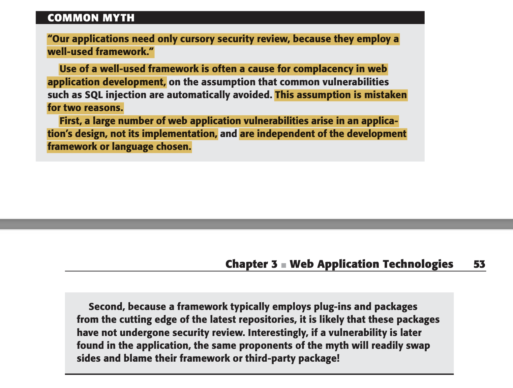

# Cybersecurity - The basics

- O objetivos destes textos serão:
    - Disseminar o conhecimento a cerca do tema
    - Me ajudar a fixar as ideias gerando discussões.

Existem 4 campos em que Web Applications devem se preocupar em proteger. São eles:

- Lidar com autenticação e acesso de usuários para previnir acesso não autorizado a recursos.
- Não se deve confiar em inputs do usuário. Toda entrada fornecida deve ser tratada como um ataque em potencial.
- Aplicações devem não somente agir passivamente, mas também ativamente frustrando as tentativas de ataque.
- Monitorar as atividades é essencial para tomar atitudes e gerenciar funcionalidades prevenindo alcance de novos privilégios.

## Lidando com acesso do usuário

A maioria das aplicações web possuem uma tríade inter-relacionada de mecanismos de segurança;

- Autenticação
- Gerenciamento de sessão
- Controle de acesso.

**Autenticação** é a forma mais básica de segurança que se pode realizar em uma aplicação. Aplicações mais recentes tem usado com cada vez mais frequência autenticação utilizado dois fatores, seja SMS, ou um app gerador de tokens.

**Gerenciamento de sessão** é geralmente combinada à autenticação para auxiliar na realização de ações feitas pelo usuário. De que forma? Usuários logados ou não recebem tokens que gerenciam a sessão. Esses tokens identificam as ações performadas e as unificam juntamente com usuários quando logados.

**Controle de acesso** é geralmente utilizado para limitar quais ações são possíveis para cada tipo de usuário. Se os mecanismos anteriores estiverem perfeitamente implementados, os usuários estarão acoplados as suas respectivas funções no sistema. Porém em sistemas complexos, com diferentes tipos de atribuições a cada tipo de usuário, isso é uma das principais fontes de bugs de segurança. Ganhos de privilégio são frequentes quando um sistema é atacado possui este tipo de implementação. Com frequência hackers mais dedicadas tentam explorar ao máximo funcionalidades como esta que pode leva-los a ganhar privilégios de administrador.



## Lidando com inputs de usuário.

Uma importante ideia que deve ser considerada para qualquer um que trabalhar com sistemas que possuem interação com o usuário: **toda entrada fornecida pode ser uma tentativa de ataque.** Uma grande parte dos ataques contra aplicações web envolvem submeter entradas inesperadas gerando resultados que não eram a intenção inicial dos desenvolvedores. Consequentemente estes resultados podem entregar não somente dados, mas em ultimo caso oferecer um porta de entrada de atacantes a servidores. Cada aplicação deve gravar na base de dados, escrever no disco, ser passada entre todas as camadas da aplicação e retornada de maneira segura. Existem diversas abordagens que tentam mitigar as tentativas de entrada de atacantes.

### *Reject Known Bad*

- Basicamente rejeitar toda e qualquer tipo de string que pode ser potencialmente utilizada para ataques.
- Porém esta abordagem não é muito efetiva visto que essas entradas podem evoluir rapidamente e se adaptar aos diversos tipos de filtros impostos pelo sistema.

### *Accept Known Good*

- Aceita entradas com formatos que você confia.
- É conhecida como uma das melhores formas de mitigar ataques, porém é pouco flexível à mudanças. Ex.: Nomes com assento e/ou hífen.

### *Sanitization*

- Essa abordagem assume que algumas vezes a entrada fornecida precisa ser reconfigurada e reescrita para ser aceita.
- O processo de "escapar" um caracter especial é um processo de sanitização.
- Por muitas vezes não um procedimento que chegue a evitar um ataque.

### *Safe data handling*

- É considerar que todo o input fornecido deve ser validado antes de usado.
- Um exemplo comum é a parametrização de SQL.

### ***Boundary validation***

É o processo de validação/sanitização da entrada a cada passo do processo. Significa que o frontend não confiara no input do usuário, fazendo-o obedecer um padrão. O backend ao receber o input também fará uma sanitização e uma validação do input. Ao passar para a camada de dados, o banco também parametrizará o dado de entrada. A cada componente são feitos validações e checagens em cima de qualquer entrada.

### *Multistep validation and Canonicalization*

É o processo de, ao detectar possíveis strings que indicam ataques, realizar a sanitização e realizar a passagem de um input valido ao o componente. Entretanto existem problemas com relação a esta abordagem. Nunca será possível para um desenvolvedor cobrir todos os cenários tão variados eles são. Temos o exemplo em XSS:

Queremos evitar Cross-site Scripting retirando a palavra `<script>` de toda e qualquer string. Isto é:

```jsx
<script>alert(document.cookie)</script>

will become

alert(document.cookie)
```

Mas agora imagine que um atacante note isso e passe a enviar a seguinte entrada:

```jsx
<scr<script>ipt>alert(document.cookie)</scr<script>ipt>

will become...

<script>alert(document.cookie)</script>
```

Cobrir todos os cenários possíveis é uma tarefa praticamente impossível visto que tanto os frameworks e linguagens apresentam seus bugs todos os dias e cada correção pode gerar um novo bug não coberto pela mitigação.

## Mitigar um ataque

Existem basicamente 4 formas de se mitigar uma tentativa de ataque:

- **Previnir que errors cheguem até o usuário final (Handling errors)**
- **Manter logs para verificação de atividade suspeita**
- **Ao se detectar a atividade suspeita alertar os administradores do sistema para que uma ação seja tomada. O ideal é que isso seja algo já programaticamente executado dada uma detecção de possível ataque.**
- **Contra medidas aos atacantes.**

### *Handling errors*

Todo e qualquer erro que acontece no sistema **não pode** ser exibido ao usuário final. Exibir qualquer mensagem de erro ao usuário é como se entregássemos a atacantes a dica de como o sistema funciona. E qualquer informação a pessoas dedicadas a escalar vulnerabilidades é um passo a menos a ser cumprido. Mensagens de erros muito "verbosas" podem certamente conceder bastante informação.

## *Logs*

São uma das ferramentas mais úteis na hora de detectar mal uso de sistemas por atacantes. A mudança de uma string hidden em HTML que nunca deveria mudar sendo passada ao backend deve acender um alerta vermelho no sistema. Muitas requisições de tokens de autenticação por usuários diferentes é uma indicação de que alguém pode estar tentando algo que não deveria. Se todas essas informações que trafegam através do sistema estiveram presentes em logs bem estruturados, detecções de invasores e atacantes serão menos difíceis.

### Alertando admins

Existindo logs estruturados e bem definidos o alerta aos sysadmins é trivial. Qualquer detecção anormal de: tentativa de login, reset de senha, muitos requests ao backend, parâmetros incorretos sendo passados ao backend, qualquer atividade que não seria possível de acontecer por um usuário comum deve ser alertada como possível tentativa de ataque.

Geralmente esses alertas se baseiam em um cruzamento de anomalia e assinaturas, sendo o segundo padrões de strings geralmente usadas para ataques como o visto anteriormente no XSS.

### Reagindo a ataques: Contramedidas

Qualquer medida que gere frustração aos atacantes é bem vinda. Seja reduzir a velocidade de resposta do servidor, seja recusar requests lançando HTTP 429. Qualquer contramedida que frustre a tentativa de escalar uma vulnerabilidade causará impacto ao atacante fazendo-o não querer prosseguir.